# Project Description: 
## Music Artist Networking Site:
This is a Music artist website which will provide artist detail to promoters, club owners, and concert venues as well as giving them the option to upload their own artist to the website. There will be a login function with username and password in order to protect music artist information from individuals outside the music industry.  The following information is available per the artist. 

* Name
* Bio
* Location
* Genre
* Social 
* Email
* Company 
* Memberships
* Image
* Videos (possible) - django-embed-video
* Personal Website

# Wireframe Below

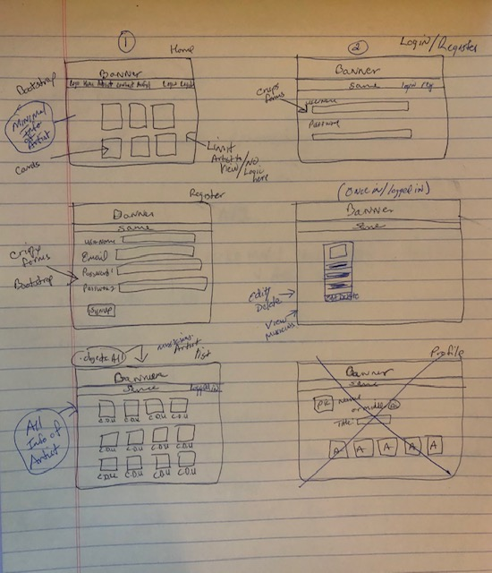

# Project Links: 
github repo: https://github.com/pmorales4/project4-capstone-django 
Deployment Link: https://musiciansiteapp.herokuapp.com/

# Project Design Features:
The project will be built in Python and Django for both frontend and backend. I will utilize the framework 'Pillow' to add images to the site as uploads. 

# Secured Access to Site: 
Login | Registration page for anyone individual wanting to upload data for a musician, view a musician, edit or delete a musician.

# Backend:
I will use postgres SQL. 

# Frontend: 
I will use Django Templates and build them out within the application
The possibility to add - django-embed-video - I will try to add as well. I will use bootstrap for CSS 

# Issues: 
The main is is rendering a picture to screen after production phrase.  I am figuring out the path to pics and it is through an error concerning the path on AWS from Herokul.  I have used the PILLOW framework in django to add and pictures. 

# Brief Example
## MVP / PostMVP - Pictures and Explanations: 
## Home Page & Mobil Responsive as well. You can add and edit artist from your iphone. 
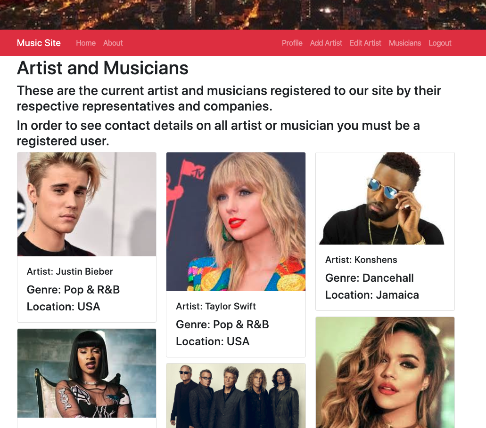

Once someone lands of homepage they are able to see what artist or musician has been uploaded to database. They are able to see just three items about the artist until they register with the platform. 

## Logged in Page
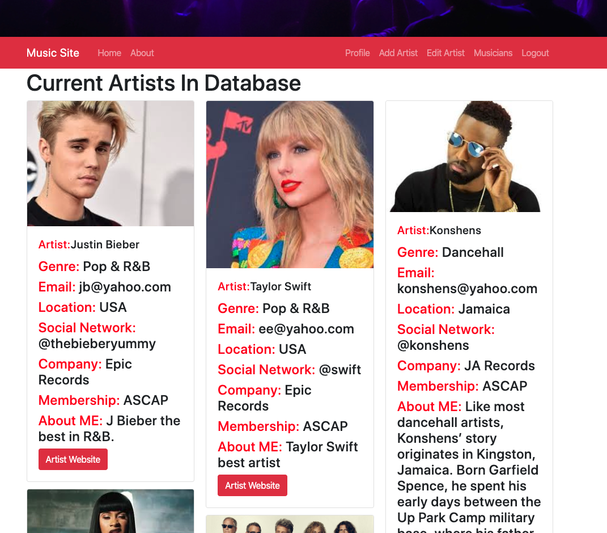

Once logged in the individual is able to see a lot of information about the artist and they are able to press on a link that takes them to the personal website of the artist. 

## Edit and Delete Pages
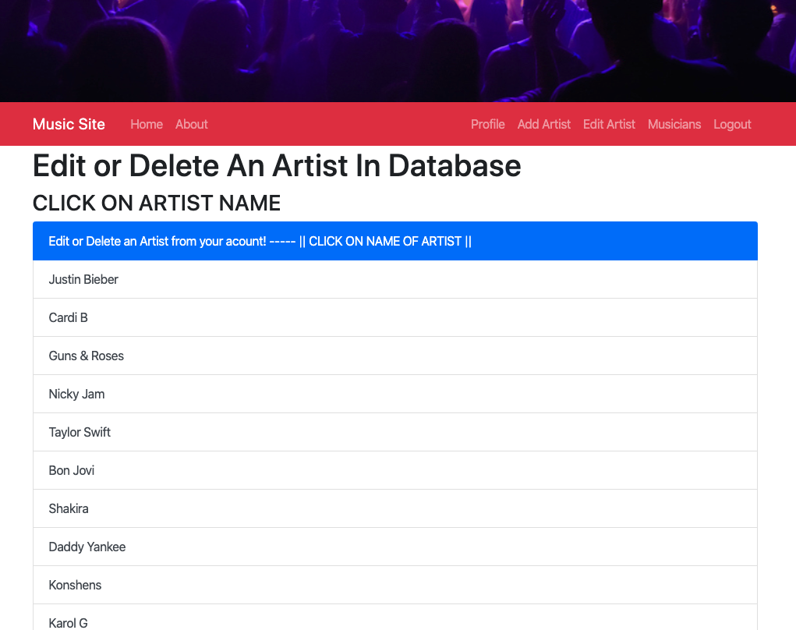
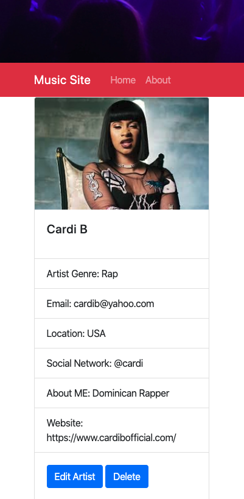

On this page the individual logged in is able to delete or edit an individual artist on the platform.  They must click on the name and sent to another screen for the edit and delete. 

## Add artist and Form pages.
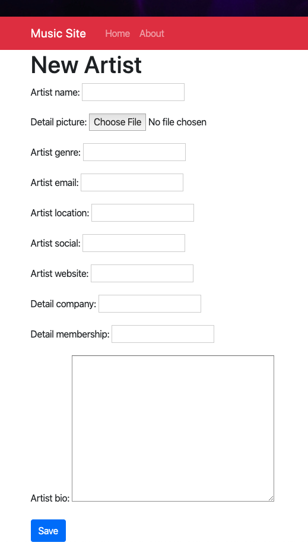

Here you are able to add a new artist once you are logged into the platform.  

# List of Features: Website Above & Mobil Below
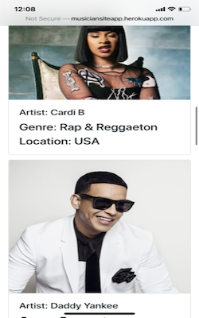
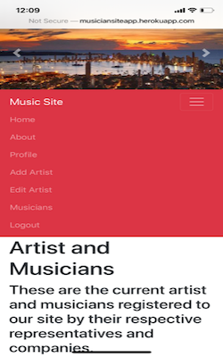
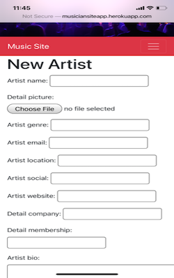
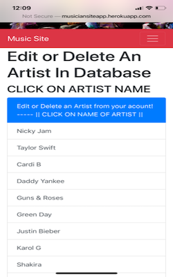
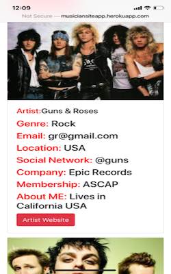

###############

## Resource Learned and Used on Project:

### Django Resources:
Django Authentication System: https://docs.djangoproject.com/en/3.0/topics/auth/default/
Django Contrib Auth System: https://docs.djangoproject.com/en/3.0/ref/contrib/auth/
Django Crispy Forms: https://django-crispy-forms.readthedocs.io/en/latest/install.html
Bootstrap Documentation: https://getbootstrap.com/docs/4.4/content/reboot/
Django Excellent Resource - 'Form Inheritance Section' - Under: Creating forms from models Documentation (YOU CAN OVERRIDE YOUR MODELS ONCE CREATED VIA FORMS.PY): https://docs.djangoproject.com/en/3.0/topics/forms/modelforms/
Django Tutorials: https://www.youtube.com/watch?v=3aVqWaLjqS4&list=PL-osiE80TeTtoQCKZ03TU5fNfx2UY6U4p&index=7
Django Tutorials: https://www.youtube.com/watch?v=JT80XhYJdBw
Django Project: https://www.djangoproject.com/start/
Real Python Deployment: https://realpython.com/deploying-a-django-app-and-postgresql-to-aws-elastic-beanstalk/
Heroku Dev Center - Django and Static Assets: https://devcenter.heroku.com/articles/django-assets
Heroku Gunicorn: https://devcenter.heroku.com/articles/python-gunicorn
Heroku AWS Store static assets: https://devcenter.heroku.com/articles/s3

### Pillow & PIL Resources:
Pillow Resize Images if Big: https://pillow.readthedocs.io/en/3.1.x/reference/Image.html
Pillow framework to use PIL: https://auth0.com/blog/image-processing-in-python-with-pillow/
PIL code image: https://code-maven.com/resize-image-using-python

